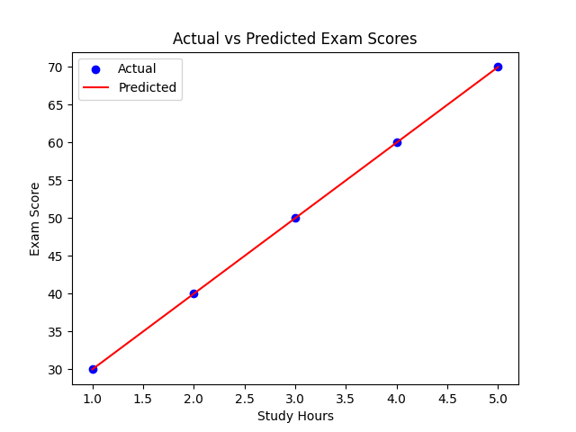
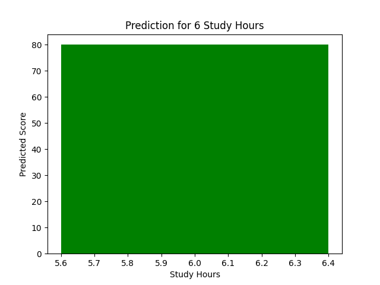

# Student Score Prediction (Machine Learning)

This project predicts a student's exam score based on the number of hours studied using a simple Machine Learning model.

## Project Overview

The goal of this project is to demonstrate a complete ML workflow:

1. Load dataset
2. Train a Linear Regression model
3. Evaluate the model (MSE, R²)
4. Visualize predictions and actual results
5. Save the trained model
6. Serve the model through an API

## Project Structure

- data/               # Dataset (if using CSV)
- models/             # Saved ML models
  - model.pkl
- scripts/            # Training scripts
  - train_model.py
- api/                # API for predictions
  - app.py
- graphs/             # Graphs for evaluation & prediction
  - actual_vs_predicted.png
  - prediction_example.png
- requirements.txt    # Python dependencies
- README.md           # Project documentation

## Model

Algorithm: Linear Regression (Scikit-Learn)  
Input: Study hours  
Output: Predicted exam score  

Evaluation Metrics Example:  

| Metric | Value |
|--------|-------|
| Mean Squared Error (MSE) | 0.0 (perfect for this toy dataset) |
| R² Score | 1.0 |

## Visualizations

- actual_vs_predicted.png → Shows the actual vs predicted exam scores  
- prediction_example.png → Example prediction for 6 study hours  

  
  

## Example API Request

Send a POST request to the API:

URL: http://127.0.0.1:5000/predict  

Request JSON:
`json
{
  "Study_Hours": 6
}
### Response:
{
  "Predicted_Score": 80
}

## How to Run the Project

### Install dependencies:
pip install -r requirements.txt

### Train the model:
python scripts/train_model.py

### Run the API:
python api/app.py

### The API will run at:
http://127.0.0.1:5000

## Author
Zaynab -
Machine Learning Engineer (Learning Journey)